> **17/11/2024**
>
> **CP** **Plus**
>
> **Security** **Assessment** **Report**
>
> **CP-XR-DE21-S** **-4G** **Router** **Firmware** **version**
> **1.031.022**
>
> **Company** **Details**

||
||
||
||
||

> **Document** **History**

||
||
||
||

> **<u>Security Assessment Details</u>**
>
> 1.1 Executive Summary

Security Assessment of **CP-XR-DE21-S** **-4G** **Router** -
**Firmware** **version** **1.031.022** model has been performed,
considering below common security issues:

✔ If any Hardware debug ports are open.

✔ If any device logs are accessible to third person

✔ If proper access control is implemented across the device.

✔ If proper Authorization & Authentication System is implemented.

Overall security postures of the device are good, though some of the
security controls/measures have not been properly thought of/implemented
during the design and coding of the application.

The security assessment revealed 1 medium severity issue in this
product.

The consolidated summary of the assessment has been presented in the
Executive Summary section. Additional information is contained within
the Detailed Vulnerability Information section of this report.

> 1.2 Scope and Objectives

The scope of this assessment was limited to Hardware, Firmware and
Wireless Communication of CP-XR-DE21-S -4G Router .

> 1.3 Technology Impact Summary

The security assessments on the Hardware, Firmware and Wireless
communication has been performed. These assessments aim is to uncover
any security issues in the assessed 4G router explain the impact and
risks associated with the found issues, and provide guidance in the
prioritization and remediation steps.

It was identified that CP-XR-DE21-S -4G Router is having UART port open
to read the boot logs.

► An attacker can read boot logs such as BLE connection event, firmware
version and sensor data from UART port

> 1.4 Business Impact Summary
>
> Following is the business impact
>
> ► The boot logs and sensor data on UART is threat to IP of the product
> from the business competitors.
>
> 1.5 Testing Environment and Tools
>
> To perform hardware security assessment over the CP-XR-DE21-S -4G
> Router hardware tools such as USB-UART converter, Picocom utility.
>
> 1.6 Table of Findings

||
||
||
||

> 1.7 Device Strengths
>
> Not discussed.
>
> 1.8 Device Weakness
>
> The below mentioned vulnerabilities were identified during the process
> of Hardware security testing.
>
> ► The device logs can be accessible over UART port
>
> **<u>Technical Findings</u>**
>
> 2.1 CP-XR-4G-01: UART Port Exposing Serial Logs

Potential Impact : MEDIUM

**Description** :

During the assessment it was identified that whenever logs from UART
port are accessible that includes boot logs, hardware addresses,
register dump,

**Affected** **Hosts** : UART Port, Device boot.

**Technical** **Risk** : The technical sensor parameters sensed and
calculated by device are can be accessed in original data transmission
format

**Business** **Risk** : By understanding the log structure, the
malicious actor can craft the malicious payload and bypass boot or
firmware update.

**Mitigations** : In the final production the UART logs can be disabled.

**Steps** **to** **Reproduce:**

> 1\. Disassemble the CP-XR-DE21-S -4G Router and find UART pins viz 3.3
> V, Gnd,TX and RX as shown in next image.

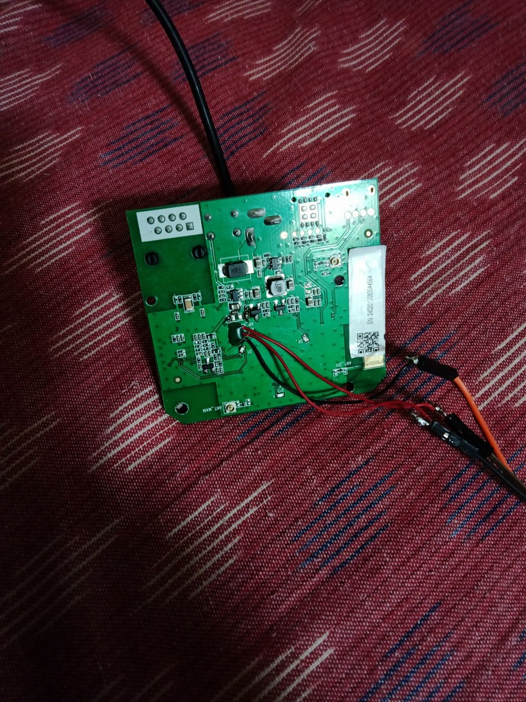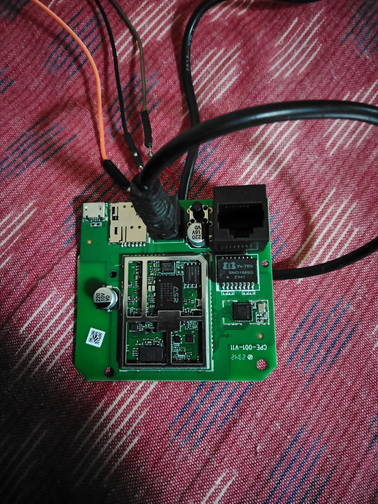

2\. Solder the pins and connect to USB to UART Converter and connect to
laptop as shown in image

3\. Run picocom serial utility on terminal as shown
below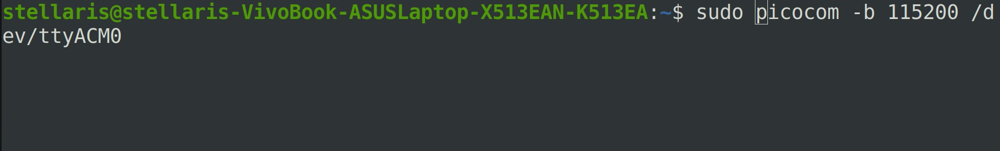

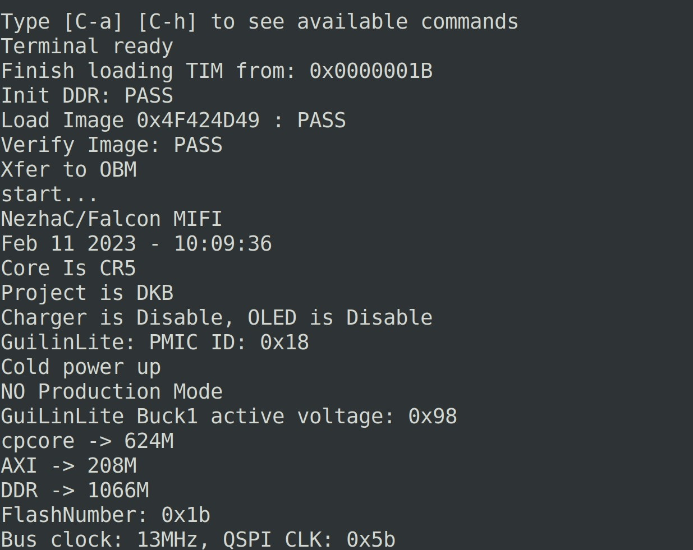4. Below are the logs available
that discloses information over UART port showing the vulnerability
after accessing UART data over Picocom.

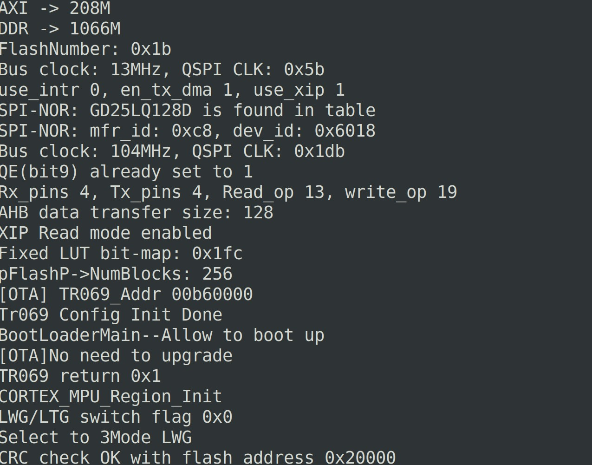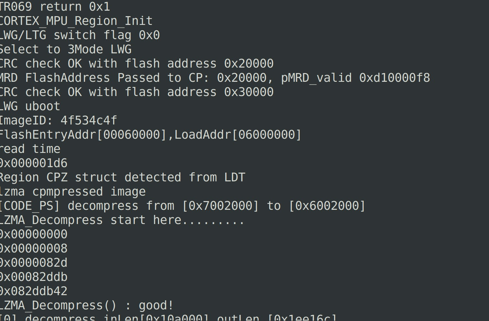

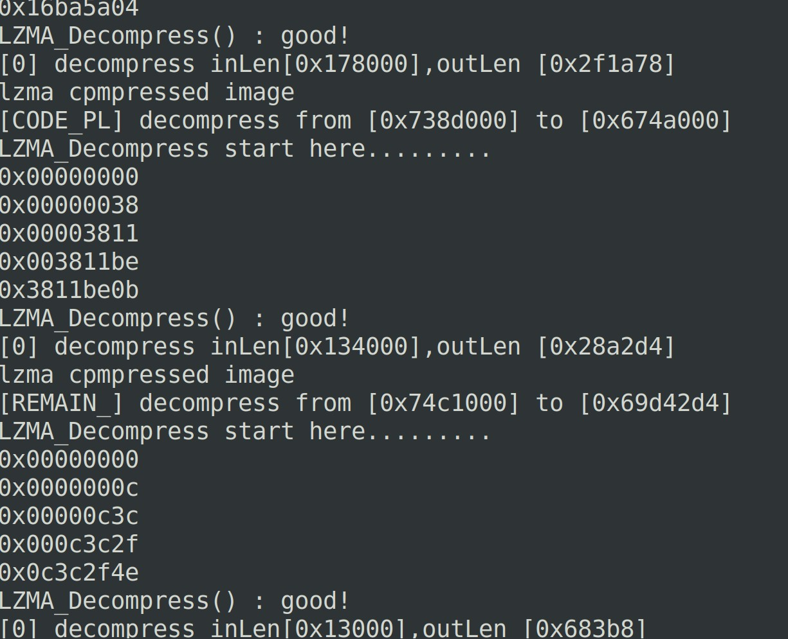

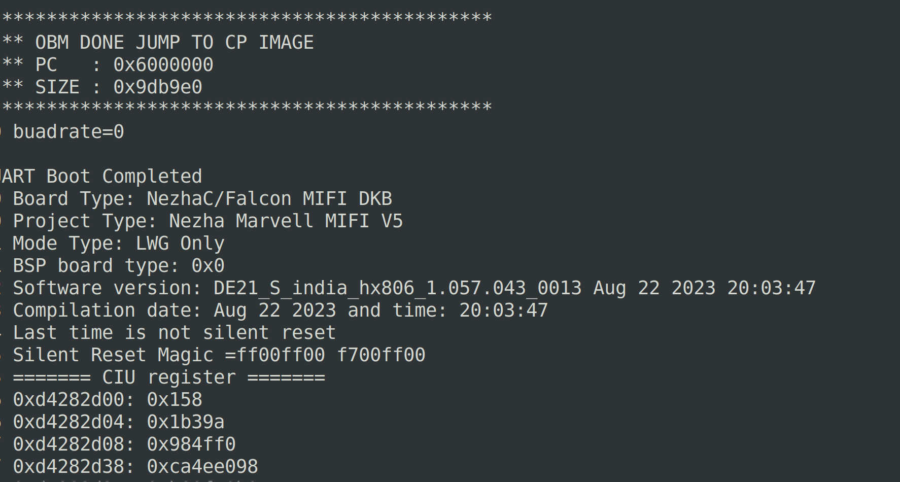

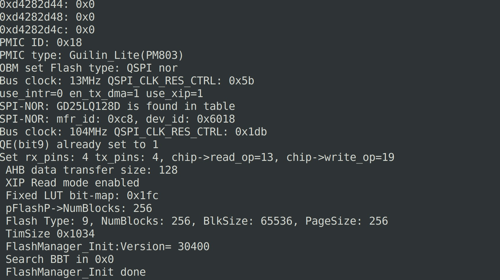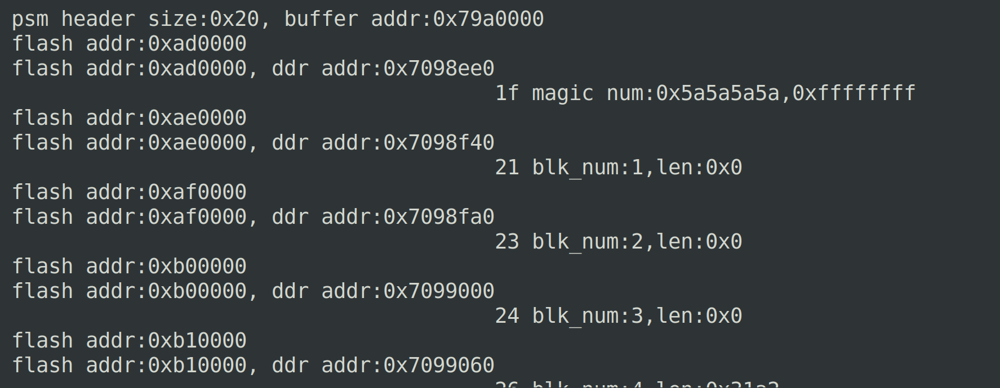

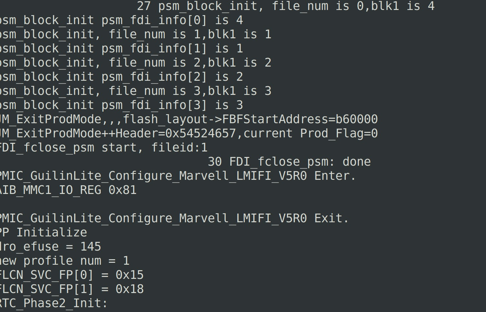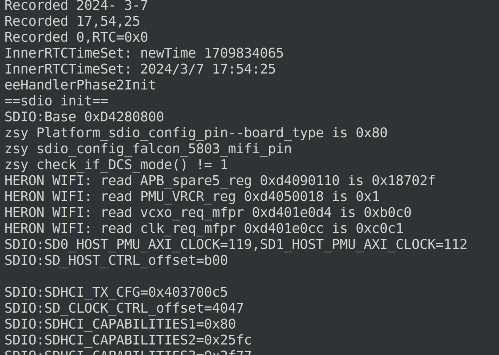

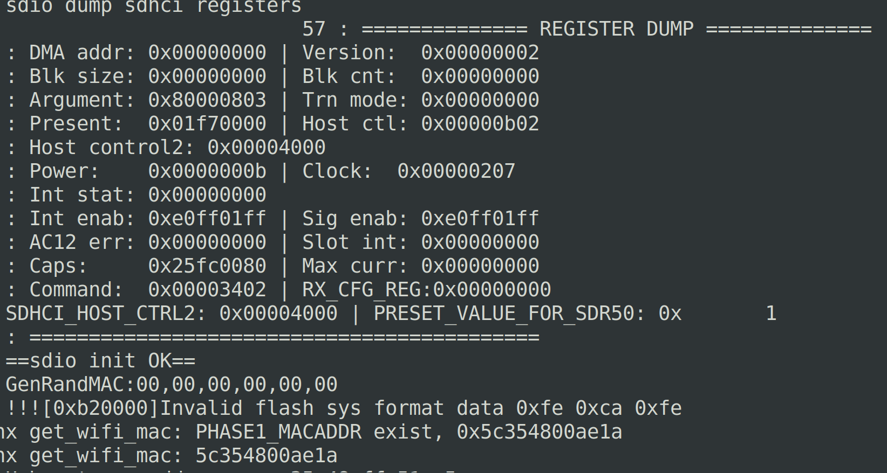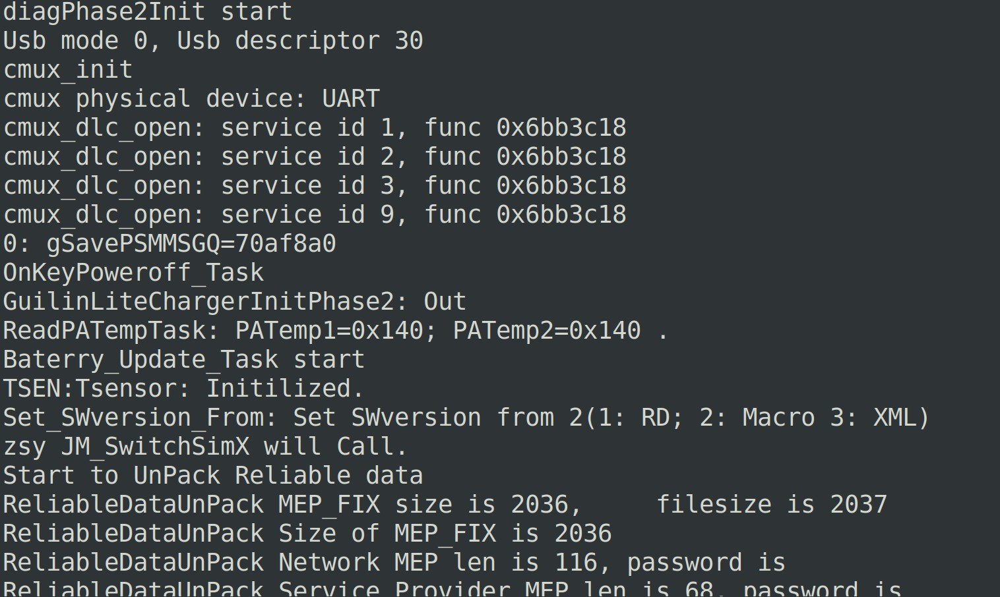

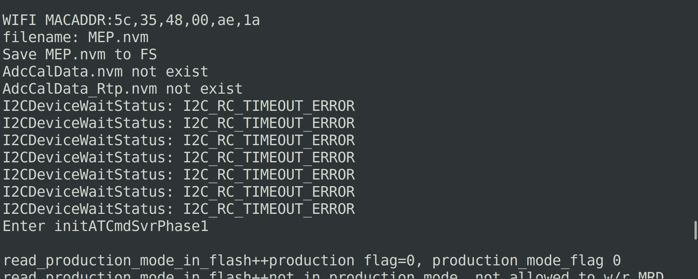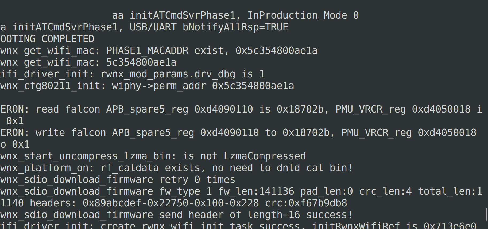

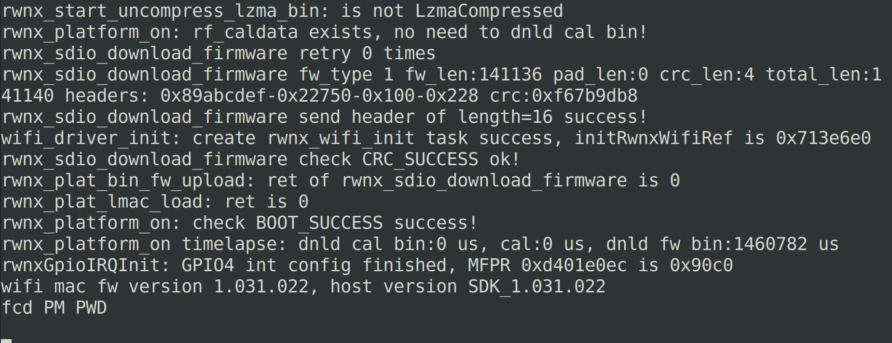

**Note** **:** **The** **firmware** **version** **is** **available**
**in** **the** **image** **above.**

**\##############** **End** **of** **Document** **\#################**
